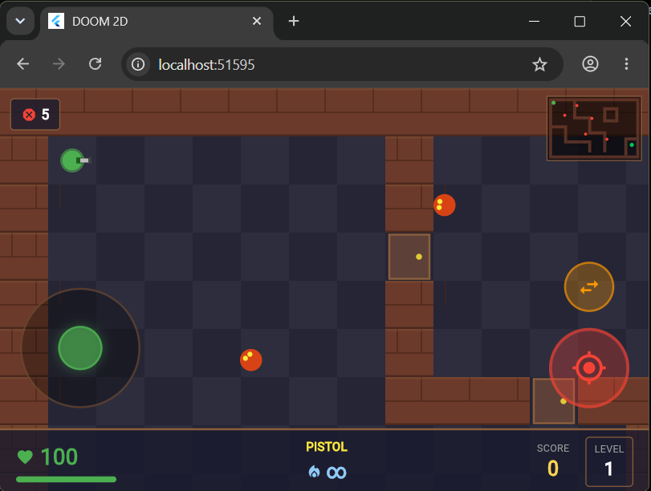
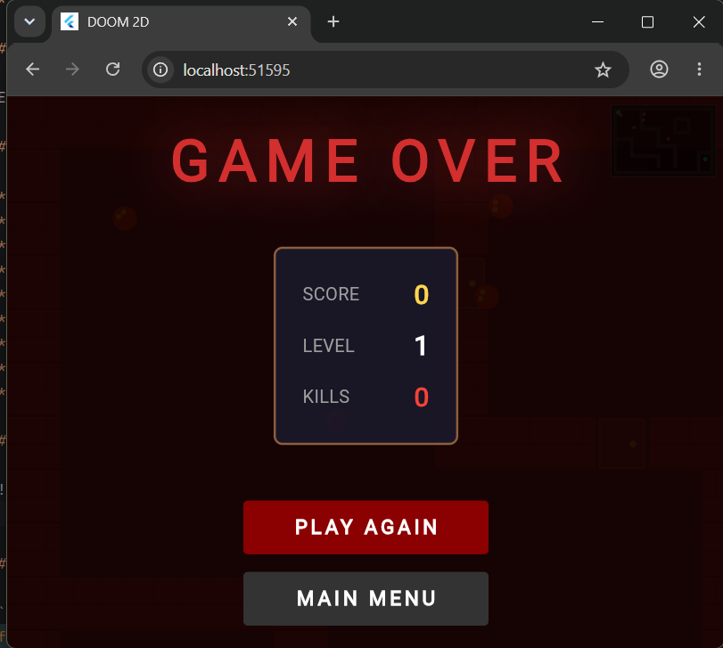

# DOOM 2D

Proyecto desarrollado en Flutter y Dart para el curso Desarrollo de Aplicaciones Móviles Avanzadas.

## Requisitos

* Flutter SDK
* Dart SDK
* Android Studio

## Instalación

```bash
flutter pub get
flutter run
```

## Arquitectura

El proyecto está organizado en las carpetas:

* game/: lógica del juego
* rendering/: renderizado mediante CustomPainter
* ui/: interfaz de usuario
* utils/: constantes y utilidades

## Implementación del Game Loop

El Game Loop se implementa utilizando un Ticker de Flutter. En cada actualización se calcula el delta de tiempo (dt), se actualiza el estado del jugador, enemigos, proyectiles y colisiones, y posteriormente se solicita el repintado del Canvas.

## Funcionalidades

* Movimiento mediante joystick virtual
* Sistema de disparo
* Cambio de armas
* Enemigos con IA básica
* Sistema de colisiones
* Tres niveles jugables
* HUD estilo DOOM
* Pantalla de Game Over
* Partículas y efectos visuales

## Capturas






## Generación APK

```bash
flutter build apk --release
```
